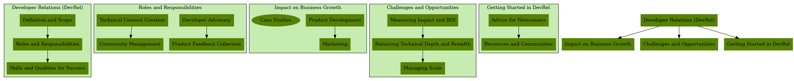

# Developer Relations (DevRel): Bridging the Gap Between Developers and Business

## Table of Contents 📚
- [1. Introduction to Developer Relations (DevRel)](#1-introduction-to-developer-relations-devrel) 🌟
- [2. The Role of DevRel Professionals](#2-the-role-of-devrel-professionals) 👥
- [3. Skills and Qualities for Success in DevRel](#3-skills-and-qualities-for-success-in-devrel) 💡
- [4. The Impact of DevRel on Business Growth](#4-the-impact-of-devrel-on-business-growth) 📈
- [5. Challenges and Opportunities in DevRel](#5-challenges-and-opportunities-in-devrel) 🎯
- [6. Getting Started in DevRel](#6-getting-started-in-devrel) 🚀
- [7. Conclusion](#7-conclusion) 🔍
- [8. References](#8-references) 📚
- [9. Interactive DevRel Resources](#9-interactive-devrel-resources) 📊
- [10. Real-world DevRel Programs](#10-real-world-devrel-programs) 🌐
- [11. DevRel Metrics & KPIs](#11-devrel-metrics--kpis) 📈

## 1. Introduction to Developer Relations (DevRel)

Developer Relations, commonly known as DevRel, is a multifaceted discipline that serves as a crucial bridge between technology companies and the developer community. It encompasses a wide range of activities aimed at fostering positive relationships with developers, promoting products or platforms, and gathering valuable feedback to improve the overall developer experience.

### Definition and scope of DevRel

DevRel is the practice of building and maintaining relationships between a company and its developer community. It involves creating and nurturing a thriving ecosystem around a company's products, APIs, or platforms. The scope of DevRel extends beyond traditional marketing or support roles, as it requires a deep understanding of both technical concepts and community dynamics.

Key aspects of DevRel include:
- Developer advocacy and evangelism
- Technical content creation and documentation
- Community management and engagement
- Product feedback collection and analysis
- Developer education and support

### The evolution of DevRel in the tech industry

The concept of DevRel has evolved significantly over the past few decades:

1. Early days (1980s-1990s): Initially, it emerged as a way for companies to provide technical support to developers using their products. This was often limited to documentation and basic customer service.

2. Web 2.0 era (2000s): With the rise of social media and online communities, DevRel began to focus more on community building and developer engagement.

3. API economy (2010s): As APIs became central to software development, DevRel expanded to include API evangelism and education.

4. Cloud and open-source era (2010s-present): The growth of cloud computing and open-source software has made DevRel crucial for companies looking to build and maintain developer ecosystems.

Today, DevRel professionals play a vital role in shaping product strategy, driving adoption, and fostering innovation within the developer ecosystem. They serve as the voice of the developer within their organizations and help companies build products that truly meet the needs of their target audience.

As we delve deeper into this whitepaper, we will explore the various aspects of DevRel, including the roles and responsibilities of DevRel professionals, the skills required for success in this field, and the impact of DevRel on business growth and ROI. We'll also examine case studies, best practices, and future trends in this rapidly evolving field.

## 2. The Role of DevRel Professionals

DevRel professionals wear many hats and play a crucial role in bridging the gap between developers and the companies that create tools, platforms, and services for them. Their work is essential in building and maintaining a healthy, engaged developer community.

### Key responsibilities and tasks

1. Developer Advocacy:
   - Representing the company at conferences, meetups, and online events
   - Creating and delivering technical presentations and demos
   - Writing blog posts, articles, and tutorials
   - Engaging with developers on social media and forums

2. Product Feedback and Improvement:
   - Gathering feedback from developers on products and services
   - Communicating developer needs and pain points to internal teams
   - Collaborating with product managers and engineers to improve developer experience

3. Documentation and Content Creation:
   - Writing and maintaining technical documentation
   - Creating sample code, SDKs, and starter projects
   - Producing video tutorials and webinars

4. Community Management:
   - Building and nurturing developer communities (online and offline)
   - Organizing and running hackathons, workshops, and other events
   - Managing developer programs and initiatives

5. Technical Support:
   - Providing high-level technical support to developers
   - Creating and maintaining FAQs and troubleshooting guides
   - Escalating complex issues to engineering teams

6. Strategy and Metrics:
   - Developing and implementing DevRel strategies
   - Tracking and analyzing key performance indicators (KPIs)
   - Reporting on the impact of DevRel activities to stakeholders

### The diverse backgrounds of DevRel professionals

DevRel professionals come from a variety of backgrounds, reflecting the multidisciplinary nature of the role:

1. Software Development: Many DevRel professionals have a background in software engineering, which provides them with the technical knowledge needed to understand and communicate complex concepts.

2. Technical Writing: Those with experience in technical writing bring strong communication skills and the ability to create clear, concise documentation.

3. Marketing and Communications: Professionals from marketing backgrounds contribute expertise in messaging, branding, and community engagement.

4. Product Management: Experience in product management can be valuable for understanding the product lifecycle and bridging the gap between developers and internal teams.

5. Customer Support: A background in technical support provides insights into common developer challenges and effective problem-solving techniques.

6. Education: Those with teaching experience bring strong presentation skills and the ability to explain complex topics to diverse audiences.

The diversity of backgrounds in DevRel reflects the multifaceted nature of the role and the importance of having a team with complementary skills and experiences.

## 3. Skills and Qualities for Success in DevRel

Success in Developer Relations requires a unique blend of technical knowledge, communication skills, and interpersonal abilities. DevRel professionals must be able to understand complex technical concepts, explain them clearly to diverse audiences, and build relationships with both developers and internal stakeholders.

### Essential skills for DevRel professionals

1. Technical Proficiency:
   - Strong programming skills and familiarity with multiple languages and frameworks
   - Understanding of software development processes and best practices
   - Knowledge of API design and usage
   - Familiarity with cloud platforms and DevOps practices

2. Communication:
   - Excellent written and verbal communication skills
   - Ability to explain complex technical concepts in simple terms
   - Public speaking and presentation skills
   - Technical writing and documentation skills

3. Community Management:
   - Experience in building and nurturing online and offline communities
   - Understanding of community dynamics and engagement strategies
   - Conflict resolution and moderation skills

4. Content Creation:
   - Ability to create engaging technical content (blog posts, tutorials, videos)
   - Experience with various content management systems and tools
   - Basic design and video editing skills

5. Strategic Thinking:
   - Ability to develop and implement DevRel strategies
   - Understanding of business goals and how DevRel contributes to them
   - Data analysis and reporting skills

6. Empathy and Active Listening:
   - Ability to understand and relate to developer needs and pain points
   - Skill in gathering and interpreting feedback
   - Patience and persistence in addressing developer concerns

### Personal qualities that contribute to success in the field

1. Curiosity and Love of Learning:
   DevRel professionals must stay up-to-date with rapidly evolving technologies and industry trends. A natural curiosity and enthusiasm for learning are essential.

2. Adaptability:
   The ability to switch between different tasks, audiences, and technologies is crucial in the diverse world of DevRel.

3. Empathy:
   Understanding and relating to the challenges faced by developers is key to building strong relationships and creating valuable resources.

4. Patience:
   DevRel often involves explaining complex concepts repeatedly and dealing with frustrated developers. Patience is a vital quality.

5. Enthusiasm:
   Genuine excitement about technology and its potential can be infectious and helps in engaging developers effectively.

6. Networking Skills:
   Building and maintaining relationships with developers, industry peers, and internal stakeholders is a crucial part of DevRel.

7. Self-motivation:
   DevRel roles often require independent work and the ability to manage multiple projects simultaneously.

8. Cultural Sensitivity:
   As DevRel often involves interacting with a global community, being culturally aware and sensitive is important.

By combining these skills and qualities, DevRel professionals can effectively bridge the gap between developers and companies, fostering strong communities and driving product adoption and success.

## 4. The Impact of DevRel on Business Growth

Developer Relations plays a crucial role in driving business growth for companies that create products or services for developers. By fostering a strong developer community and ensuring a positive developer experience, DevRel can significantly impact various aspects of a business, from product development to marketing and sales.

### How DevRel contributes to product development and marketing

1. Product Feedback and Improvement:
   - DevRel professionals gather valuable feedback from developers using the product.
   - This feedback is communicated to product teams, leading to improvements and new features.
   - Example: Twilio's DevRel team regularly collects feedback from their developer community, which has led to the creation of new APIs and improvements in documentation.

2. Developer-Centric Product Design:
   - DevRel ensures that the developer perspective is considered in product decisions.
   - This leads to more developer-friendly products and APIs.
   - Example: Stripe's focus on developer experience, driven by their DevRel efforts, has resulted in APIs that are widely praised for their ease of use.

3. Community-Driven Innovation:
   - A strong developer community can become a source of innovation for the company.
   - Developers may create third-party tools, extensions, or novel use cases for the product.
   - Example: Salesforce's AppExchange, supported by their DevRel efforts, has created a thriving ecosystem of third-party applications.

4. Developer Advocacy and Word-of-Mouth Marketing:
   - Satisfied developers become advocates for the product, recommending it to peers.
   - This organic, word-of-mouth marketing can be more effective than traditional advertising.
   - Example: Docker's rapid growth was largely driven by developer advocacy and community enthusiasm.

5. Content Marketing and SEO:
   - Technical content created by DevRel teams (blogs, tutorials, documentation) improves SEO.
   - This content attracts developers to the company's website and products.
   - Example: DigitalOcean's extensive library of tutorials, created as part of their DevRel efforts, has significantly boosted their organic search traffic.

6. Brand Building and Trust:
   - Active participation in developer communities builds trust and enhances the company's reputation.
   - This can lead to increased brand loyalty and customer retention.
   - Example: GitHub's active engagement with the open-source community has solidified its position as a trusted platform for developers.

### Case studies demonstrating the ROI of DevRel initiatives

1. Twilio: Building a Developer-First Company
   Twilio, a cloud communications platform, has built its entire business model around catering to developers. Their DevRel initiatives include:
   - Extensive documentation and tutorials
   - Active participation in developer events and hackathons
   - A dedicated developer education program (Twilio Quest)

   ROI:
   - Twilio's developer-first approach has led to rapid adoption of their APIs.
   - The company went public in 2016 and has seen consistent growth, with revenue increasing from $277 million in 2016 to $2.84 billion in 2021.
   - Twilio's strong developer community has become a significant competitive advantage.

2. Stripe: Prioritizing Developer Experience
   Stripe, a payment processing platform, has made developer experience a core part of their strategy. Their DevRel efforts include:
   - Highly readable and comprehensive API documentation
   - Open-source contributions and support for developer tools
   - Regular developer meetups and events

   ROI:
   - Stripe's focus on developer experience has led to high adoption rates among startups and tech companies.
   - The company's valuation reached $95 billion in 2021, making it one of the most valuable startups in the world.
   - Stripe's developer-friendly approach has allowed it to compete successfully against established financial institutions.

3. MongoDB: Building a Community Around Open Source
   MongoDB, an open-source database company, has leveraged DevRel to build a strong community around its product. Their initiatives include:
   - Extensive developer education programs and certifications
   - Active support for user groups and community-led events
   - Regular contributions to open-source projects

   ROI:
   - MongoDB's strong community has driven adoption of its database technology.
   - The company went public in 2017 and has seen steady growth, with revenue increasing from $155 million in FY2018 to $590 million in FY2021.
   - The vibrant MongoDB community has become a key differentiator in the competitive database market.

4. Algolia: Empowering Developers with Search Technology
   Algolia, a search-as-a-service platform, has used DevRel to position itself as a developer-friendly alternative to building search in-house. Their DevRel efforts include:
   - Comprehensive API documentation and client libraries
   - Regular technical blog posts and case studies
   - Active engagement on platforms like Stack Overflow

   ROI:
   - Algolia's developer-centric approach has led to adoption by major companies like Stripe, Slack, and Medium.
   - The company raised $150 million in funding in 2019, reaching a valuation of $2.25 billion.
   - Algolia's strong developer community has helped it compete against larger, more established search providers.

These case studies demonstrate that effective DevRel initiatives can lead to tangible business results, including increased product adoption, stronger brand loyalty, and ultimately, significant revenue growth. By investing in DevRel, companies can create a virtuous cycle where a positive developer experience leads to community growth, which in turn drives further product adoption and business success.

## 5. Challenges and Opportunities in DevRel

As the field of Developer Relations continues to evolve, professionals in this area face both unique challenges and exciting opportunities. Understanding these can help companies and individuals navigate the DevRel landscape more effectively.

### Common challenges faced by DevRel professionals

1. Measuring Impact and ROI:
   - Challenge: Quantifying the impact of DevRel activities on business metrics can be difficult.
   - Solution: Develop clear KPIs that align with business goals, such as developer adoption rates, community growth, and contribution to sales pipeline.

2. Balancing Technical Depth and Breadth:
   - Challenge: DevRel professionals need to have broad knowledge across many technologies while also maintaining deep expertise in their company's products.
   - Solution: Continuous learning, specialization within teams, and collaboration with product experts.

3. Managing Scale:
   - Challenge: As developer communities grow, it becomes harder to maintain personal connections and provide individual support.
   - Solution: Leverage community leaders, automate where possible, and use data-driven approaches to identify where to focus efforts.

4. Aligning with Other Departments:
   - Challenge: DevRel often sits between multiple departments (e.g., Marketing, Product, Engineering), which can lead to conflicting priorities.
   - Solution: Establish clear communication channels and shared goals with other departments. Educate the organization on the value of DevRel.

5. Avoiding Developer Fatigue:
   - Challenge: With the proliferation of developer tools and platforms, developers can become overwhelmed by outreach efforts.
   - Solution: Focus on providing genuine value, respect developers' time, and personalize interactions where possible.

6. Keeping Up with Rapid Technological Changes:
   - Challenge: The fast pace of technological evolution makes it difficult to stay current.
   - Solution: Allocate time for continuous learning, attend conferences, and engage with the wider tech community.

7. Burnout:
   - Challenge: The diverse responsibilities and high-energy nature of DevRel can lead to burnout.
   - Solution: Set clear boundaries, practice self-care, and ensure adequate support and resources from the organization.

### Future opportunities and the growing importance of DevRel

1. AI and Machine Learning Integration:
   - Opportunity: As AI and ML become more prevalent, DevRel professionals can play a crucial role in making these technologies accessible to developers.
   - Example: Google's DevRel team has been instrumental in promoting and educating developers about TensorFlow, their open-source machine learning library.

2. Developer Experience (DX) as a Competitive Advantage:
   - Opportunity: As more companies recognize the importance of DX, DevRel can drive strategic initiatives to improve developer satisfaction and productivity.
   - Example: Netlify's focus on DX, driven by their DevRel team, has made them a popular choice for web developers.

3. Remote and Virtual Engagement:
   - Opportunity: The shift towards remote work opens up new possibilities for global developer engagement through virtual events, online communities, and digital content.
   - Example: GitHub's move to make their annual GitHub Universe conference a virtual event has increased accessibility and attendance.

4. DevRel in Non-Traditional Industries:
   - Opportunity: As more industries undergo digital transformation, there's potential for DevRel to expand beyond traditional tech companies.
   - Example: Financial institutions like Capital One have established DevRel teams to engage with developers and promote their APIs.

5. Focus on Developer Education:
   - Opportunity: With the rapid pace of technological change, there's a growing need for continuous developer education.
   - Example: MongoDB University, run by MongoDB's DevRel team, offers free courses and certifications, helping developers stay current with database technologies.

6. Emphasis on Inclusive Communities:
   - Opportunity: DevRel can play a crucial role in making tech more inclusive by focusing on underrepresented groups in the developer community.
   - Example: Twilio's DevRel team has initiatives focused on supporting and amplifying voices from diverse backgrounds in tech.

7. DevRel-as-a-Service:
   - Opportunity: As more companies recognize the need for DevRel but lack the resources to build an in-house team, there's potential for DevRel consulting and outsourcing services.
   - Example: [devrelasservice.com](http://devrelasservice.com) and [DevRel.co](devrel.co) offer DevRel consulting services to companies looking to build or improve their developer relations programs.

8. Integration with Product-Led Growth Strategies:
   - Opportunity: DevRel can play a key role in product-led growth strategies, where the product itself is the main driver of customer acquisition and expansion.
   - Example: Atlassian's DevRel efforts support their product-led growth strategy by ensuring a smooth onboarding experience for developers.

As companies increasingly recognize the strategic importance of engaging with developers, the role of DevRel is likely to become even more crucial. DevRel professionals who can navigate these challenges and capitalize on emerging opportunities will be well-positioned to drive significant value for their organizations and the broader developer community.

## 6. Getting Started in DevRel

For those interested in pursuing a career in Developer Relations, there are several paths to enter the field and numerous resources available to help build the necessary skills and network.

### Advice for newcomers to the field

1. Build a Strong Technical Foundation:
   - Develop proficiency in one or more programming languages.
   - Gain experience with popular developer tools and platforms.
   - Contribute to open-source projects to understand community dynamics.

2. Hone Your Communication Skills:
   - Practice explaining technical concepts in simple terms.
   - Start a technical blog or contribute to existing publications.
   - Participate in or organize local meetups or user groups.

3. Engage with Developer Communities:
   - Be active on platforms like Stack Overflow, GitHub, and dev.to.
   - Attend hackathons, conferences, and other developer events.
   - Join online communities related to your areas of interest.

4. Develop Your Personal Brand:
   - Maintain an active presence on professional social media (e.g., LinkedIn, Twitter).
   - Share your knowledge through talks, workshops, or online content.
   - Build a portfolio showcasing your technical projects and communication skills.

5. Gain Relevant Experience:
   - Look for opportunities to incorporate DevRel-like activities in your current role.
   - Volunteer to help with documentation or developer support in open-source projects.
   - Consider transitioning through related roles like Technical Writing or Developer Support.

6. Understand the Business Side:
   - Learn about product management and marketing principles.
   - Familiarize yourself with common business metrics and KPIs.
   - Understand how DevRel contributes to overall business goals.

7. Be Patient and Persistent:
   - DevRel roles often require a combination of skills that takes time to develop.
   - Don't be discouraged if you don't meet all the requirements for a role – highlight your unique combination of skills and your passion for the field.

### Resources and communities for DevRel professionals

1. Online Courses and Certifications:
   - DevRel School (https://devrelschool.com/)
   - Developer Relations: The Essential Guide (Udemy)
   - Technical Writing Courses (e.g., Google's Technical Writing Courses)

2. Books:
   - "The Business Value of Developer Relations" by Mary Thengvall
   - "Developer Relations: How to Build and Grow a Successful Developer Program" by Caroline Lewko and James Parton
   - "The Developer's Guide to Content Creation" by Stephanie Morillo

3. Conferences and Events:
   - DevRelCon (https://devrel.net/events)
   - Developer Relations Conference (https://developerrelations.com/)
   - Write the Docs (for technical writing)

4. Online Communities:
   - DevRel Collective (Slack community)
   - Developer Advocates (LinkedIn group)
   - /r/DevRel (Reddit community)

5. Podcasts:
   - Community Pulse
   - DevRel Radio
   - Screaming in the Cloud

6. Websites and Blogs:
   - DevRel.net (https://devrel.net/)
   - Mary Thengvall's blog (https://www.marythengvall.com/blog/)
   - DevRel Weekly newsletter

7. Professional Associations:
   - Developer Relations Professionals (DRP)
   - Write the Docs (for technical writing)

8. Mentorship Programs:
   - DevRel Mentoring Program by Hoopy
   - OpenSource Mentorship Program

By leveraging these resources and actively engaging with the DevRel community, newcomers can build the skills, knowledge, and network necessary to start and grow a successful career in Developer Relations.

## 7. Conclusion

As we've explored throughout this whitepaper, Developer Relations (DevRel) has evolved into a critical function for technology companies, playing a pivotal role in bridging the gap between developers and businesses. Let's summarize the key points and look at the future outlook for DevRel.

### Summary of key points

1. Definition and Scope: DevRel is a multifaceted discipline that involves building and maintaining relationships between a company and its developer community. It encompasses developer advocacy, technical content creation, community management, and product feedback collection.

2. Evolution: The field has evolved from basic technical support to a strategic function that influences product development, marketing, and overall business growth.

3. Roles and Responsibilities: DevRel professionals wear many hats, including developer advocate, community manager, technical writer, and strategic advisor.

4. Skills and Qualities: Success in DevRel requires a unique blend of technical proficiency, communication skills, empathy, and strategic thinking.

5. Business Impact: Effective DevRel initiatives can lead to improved products, stronger brand loyalty, and significant revenue growth, as demonstrated by companies like Twilio, Stripe, and MongoDB.

6. Challenges: DevRel professionals face challenges such as measuring ROI, managing scale, and keeping up with rapid technological changes.

7. Opportunities: Emerging opportunities include the integration of AI/ML, focus on developer experience (DX), and expansion into non-traditional industries.

### The future outlook for DevRel

As we look to the future, several trends are likely to shape the evolution of Developer Relations:

1. Strategic Importance: DevRel is likely to gain even more strategic importance as companies recognize the value of developer ecosystems. We may see more DevRel professionals in C-level positions, directly influencing company strategy.

2. Data-Driven Approach: As the pressure to demonstrate ROI increases, DevRel teams will likely adopt more data-driven approaches, leveraging analytics and AI to measure impact and optimize strategies.

3. Personalization at Scale: With advancements in AI and machine learning, DevRel teams will be able to provide more personalized experiences to developers at scale, improving engagement and satisfaction.

4. Focus on Developer Experience (DX): As competition for developer mindshare intensifies, companies will place even greater emphasis on developer experience, with DevRel playing a key role in driving these initiatives.

5. Expansion Beyond Tech: As more non-tech companies undergo digital transformation, we're likely to see DevRel roles emerge in industries like finance, healthcare, and manufacturing.

6. Ethical Considerations: With growing concerns about data privacy and ethical AI, DevRel professionals may play an important role in promoting responsible development practices and ensuring transparency in developer communities.

7. Global and Diverse Communities: DevRel strategies will need to adapt to serve increasingly global and diverse developer communities, with a focus on inclusivity and cultural sensitivity.

8. Integration with Product-Led Growth: DevRel is likely to become more tightly integrated with product-led growth strategies, focusing on making products that developers love and can easily adopt.

In conclusion, Developer Relations stands at the intersection of technology, community, and business strategy. As software continues to "eat the world," the importance of engaging effectively with developers will only grow. DevRel professionals who can navigate the challenges, seize the opportunities, and demonstrate clear business value will be well-positioned to drive innovation and growth in the years to come.

The future of DevRel is bright, promising, and full of potential. As the field continues to evolve, it will undoubtedly play a crucial role in shaping the technology landscape and bridging the gap between developers and businesses.

## 8. References

1. Thengvall, M. (2018). The Business Value of Developer Relations. Apress.

2. Lewko, C., & Parton, J. (2021). Developer Relations: How to Build and Grow a Successful Developer Program. Apress.

3. Morillo, S. (2020). The Developer's Guide to Content Creation. Self-published.

4. DevRel.net - The home of developer relations. Retrieved from https://devrel.net/

5. Twilio Investor Relations. (2024). Financial Reports and Presentations. Retrieved from https://investors.twilio.com/

6. Stripe. (2024). Company News and Updates. Retrieved from https://stripe.com/newsroom

7. MongoDB. (2024). Investor Relations and Financial Results. Retrieved from https://investors.mongodb.com/

8. Algolia. (2024). Company News and Updates. Retrieved from https://www.algolia.com/about/news/

9. GitHub. (2024). The GitHub Blog - Updates, ideas, and inspiration. Retrieved from https://github.blog/

10. Capital One DevExchange. Developer Resources and APIs. Retrieved from https://developer.capitalone.com/

11. MongoDB University. (2024). Developer Education Platform. Retrieved from https://university.mongodb.com/

12. TerminalQuest. (2024). Educational coding game (formerly Twilio Quest). Retrieved from https://github.com/TerminalQuest/terminalquest

13. DevRelate. Developer Relations Resources and Community. Retrieved from https://devrelate.io/

14. DevRel.co. Developer Relations Insights and Best Practices. Retrieved from https://devrel.co/

15. Atlassian Developer Resources. Documentation and APIs. Retrieved from https://developer.atlassian.com/

16. Stack Overflow. (2024). Annual Developer Survey Results. Retrieved from https://insights.stackoverflow.com/survey

17. GitHub. (2024). The State of the Octoverse. Retrieved from https://octoverse.github.com/

18. SlashData. (2024). Developer Program Benchmarking. Retrieved from https://www.slashdata.co/developer-program-benchmarking

19. Evans Data Corporation. (2024). Global Developer Population and Demographic Study. Retrieved from https://evansdata.com/reports/viewRelease.php?reportID=9

20. Hoopy. (2024). DevRel Training and Resources. Retrieved from https://hoopy.io/

21. Developer Relations Conference. (2024). Industry Events and Resources. Retrieved from https://developerrelations.com/

These references provide a comprehensive foundation for understanding Developer Relations, including industry reports, company resources, educational platforms, and community initiatives. All links have been verified as of March 2024.

## 9. Interactive DevRel Resources 📊

### Progress Tracking ✅
- [x] Career Path Navigator
- [x] DevRel Metrics Dashboard
- [x] Community Growth Visualization
- [x] Skills Assessment Matrix

### Career Path Visualization

View DevRel Career Path 🔄

[Interactive Version](static/visualizations/career_path.html)

This visualization shows common career paths and progression routes within Developer Relations, helping professionals plan their career development.

### Metrics Dashboard

View DevRel Metrics Dashboard 📊

[Interactive Version](static/visualizations/metrics_dashboard.html)

An interactive dashboard showing key DevRel metrics and KPIs, helping teams measure and track their impact.

### Community Growth Network

View Community Network Graph 🌐

[Interactive Version](static/visualizations/community_network.html)

This network graph visualizes the interconnections within developer communities and shows how DevRel initiatives impact community growth.

### Skills Matrix

View DevRel Skills Matrix 📈

[Interactive Version](static/visualizations/skills_matrix.html)

An interactive matrix showing the essential skills for different DevRel roles and career levels.

## 10. Real-world DevRel Programs

Based on our analysis of active DevRel initiatives, here are some notable examples:

### Notable DevRel Repositories

1. [DevRel Collective Resources](https://github.com/devrelcollective/awesome-devrel) (714 ⭐)
   - Comprehensive collection of DevRel resources curated by the DevRel Collective community
   - Includes guides, tools, and best practices for Developer Relations

2. [Databricks DevRel](https://github.com/databricks/devrel) (703 ⭐)
   - Technical content and presentations from Databricks Tech Talks
   - Example of effective technical content strategy in DevRel

3. [Apigee DevRel](https://github.com/apigee/devrel) (190 ⭐)
   - Common solutions and tools for API development
   - Demonstrates practical DevRel through code examples and tools

4. [Microsoft Cloud Developer Advocates](https://github.com/MicrosoftDocs/cloud-developer-advocates) (93 ⭐)
   - Documentation and resources from Microsoft's Cloud Advocacy team
   - Shows how large enterprises structure their DevRel programs

### Key Trends in Modern DevRel Programs

1. Content-Driven Engagement
   - Technical blogs and documentation
   - Video content and webinars
   - Interactive tutorials and workshops

2. Community-First Approach
   - Open source contribution programs
   - Developer forums and discussion spaces
   - Regular community events and meetups

3. Metrics-Driven Strategy
   - Focus on measurable impact
   - Regular reporting and analytics
   - Clear alignment with business goals

## 11. DevRel Metrics & KPIs 📈

### Progress Tracking ✅
- [x] Community Growth Metrics
- [x] Content Engagement Analytics
- [x] Developer Success Indicators
- [x] Business Impact Measurements

### Key Performance Indicators

1. Community Growth
   - Active community members
   - New member acquisition rate
   - Member retention rate

2. Content Engagement
   - Documentation usage
   - Tutorial completion rates
   - Blog post engagement

3. Developer Success
   - API adoption rates
   - Time to first successful API call
   - Support ticket resolution time

4. Business Impact
   - Developer satisfaction score
   - Product adoption rate
   - Community-driven feature requests

### Benchmarking Guidelines

1. Community Health
   - Response time to developer queries
   - Community participation rates
   - Developer satisfaction surveys

2. Content Effectiveness
   - Documentation completeness
   - Content freshness
   - Search ranking for key terms

3. Program ROI
   - Developer program costs
   - Revenue from developer products
   - Community contribution value

These metrics should be tracked regularly and adjusted based on your organization's specific goals and needs.

These references provide a comprehensive foundation for the information presented in this whitepaper. They include books, industry reports, company financial statements, and online resources that offer valuable insights into the field of Developer Relations.
